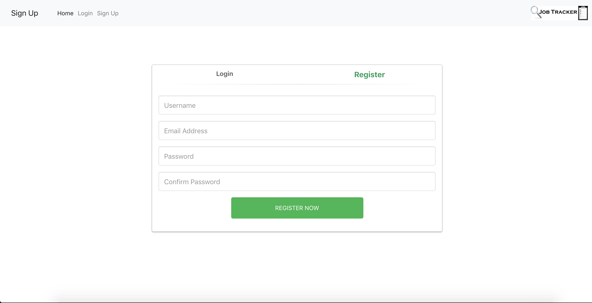
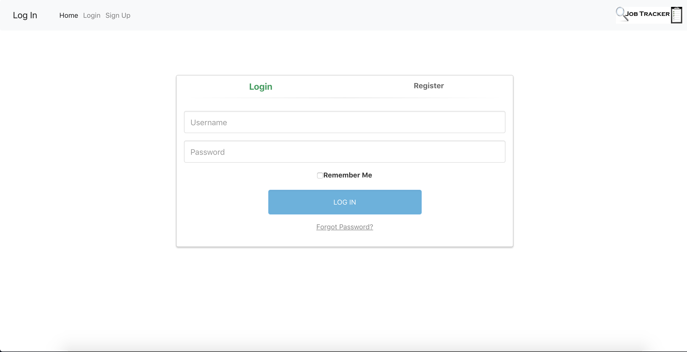
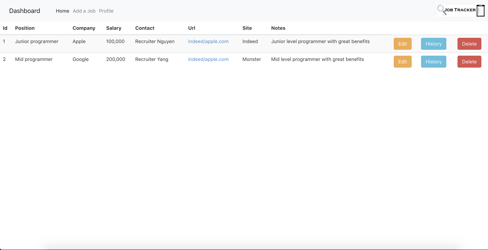
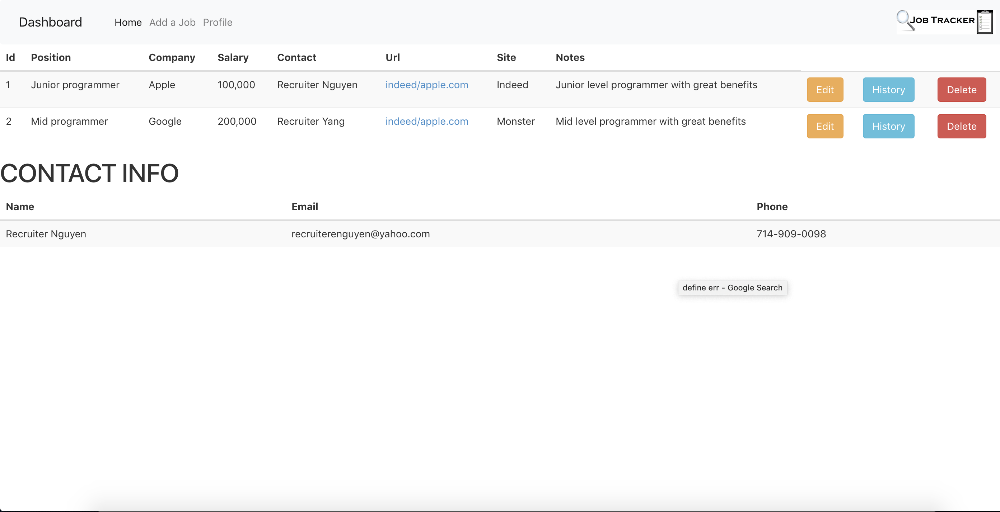
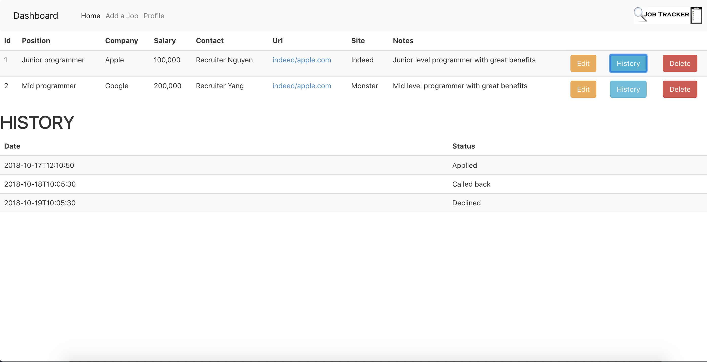
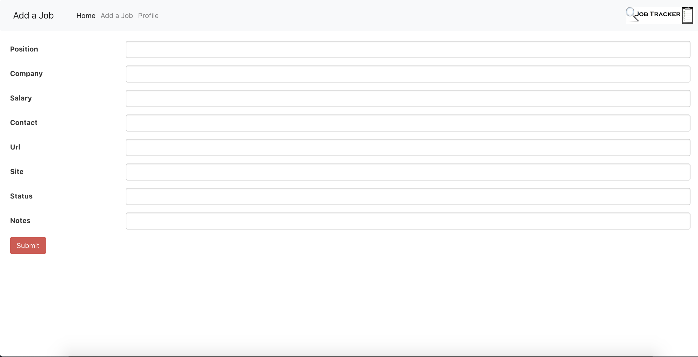

# Job Tracker

Job Tracker is a web application that helps applicants on the job hunt track the jobs they applied to.

## Table of Contents

- [Getting Started](#getting-started)
- [Prerequisites](#prerequisites)
- [Downloading The Project](#downloading-the-project)
- [Setting Up The Database](#setting-up-the-database)
- [Setting Up The Front End](#setting-up-the-frontend)
- [Setting Up The Back End](#setting-up-the-backend)
- [Running The Project](#running-the-project)
- [Built With](#built-with)
- [Authors](#authors)

## Getting Started

These instructions will get you a copy of the project up and running on your local machine for development and testing purposes. 

### Prerequisites

In order to run this project, you need to have [Node.js](https://nodejs.org/en/), [.NET Core](https://www.microsoft.com/net/download), and [PostgreSQL](https://www.postgresql.org/) installed. To tell if you have them installed, open your Command Line/Terminal and type the following:

```
$ node -v
v10.x.x
$ psql --version
psql (PostgreSQL) 10.x
$ dotnet --version
2.x.xxx
```

### Downloading The Project

To begin setting up the project, either download the project by clicking [here](https://github.com/m1771vw/JobTracker/archive/master.zip) or by cloning the project: 

```
$ git clone https://github.com/m1771vw/JobTracker.git
$ cd JobTracker
```

### Setting Up The Database

In order to setup the database, a sample script has been created.

Start from the root of the project folder. To check if you are in the root, use `pwd` and `ls` to check the folder structure. You should see something like this: 

```
$ pwd
/Users/.../JobTracker
$ ls
assets csharp-end postgresql-scripts reactjs-front-end
```
After confirming you're in the root, go to the `postgresql-scripts` folder and run the script.

```
$ cd postgresql-scripts
$ psql < jobtrackerscript.SQL
```
<!-- 
If it runs successfully, you will see:
```
DROP DATABASE
CREATE DATABASE
You are now connected to database "technoprojectdb" as user "[user]".
CREATE TABLE
INSERT 0 3
CREATE TABLE
INSERT 0 5
CREATE TABLE
INSERT 0 4
CREATE TABLE
INSERT 0 8
CREATE TABLE
INSERT 0 8
CREATE TABLE
INSERT 0 6
CREATE TABLE
INSERT 0 6
``` -->
### Setting Up The Front End

Return to the root of the project folder and go to the `reactjs-front-end` directory and run `npm install`:
```
$ cd ..
$ cd reactjs-front-end
$ npm install
```
After the dependencies have been installed, you can move onto the backend.

### Installing The Back End

Return to the root of the project folder and go to the `csharp-backend` directory and run `dotnet restore`:
```
$ cd ..
$ cd csharp-backend
$ dotnet restore
```

You can now start up the project.

### Running The Project

To run the project, you will need to have two console windows open, one in the `reactjs-front-end` directory, and one in the `csharp-backend` directory. 


Run `dotnet run` with the `csharp-backend` first and then run `npm start` with `reactjs-front-end` once the backend finishes starting up.

To confirm the backend has started, you should see something similar to the following with no errors:

```
Now listening on: https://localhost:5001
Now listening on: http://localhost:5000
Application started. Press Ctrl+C to shut down.
```

To confirm the frontend has started, you should be greeted with this screen.

<p align="center">
  
</p>

## Using Job Tracker

To login, first sign up.

<p align="center">
  
</p>

After signing up, go to the login page.

<p align="center">
  
</p>

Once you successfully log in, you will see the **Dashboard**. 

<p align="center">
  
</p>

This is where you can see the list of jobs that you have signed up for. You can see the recruiter information by clicking on their name, and track the history for that job status by clicking on **History**.

<p align="center">
  
</p>

<p align="center">
  
</p>


You can press the **Add Job** tab to add a new job.

<p align="center">
  
</p>


## Built With

* [React.js](https://reactjs.org/) 
* [Redux](https://redux.js.org/)
* [.NET Core](https://www.microsoft.com/net/download)
* [Entity Framework Core](https://docs.microsoft.com/en-us/ef/core/)
* [bcryptjs](https://www.npmjs.com/package/bcryptjs)
* [jsonwebtoken](https://www.npmjs.com/package/jsonwebtoken)
* [PostgreSQL](https://www.postgresql.org/) 

## Authors

* **William Yang** - *Initial work* - [m1771vw](https://github.com/m1771vw)
* **Douglas Nguyen** - *Initial work* - [Doogienguyen](https://github.com/Doogienguyen)

## Contributors

You can look here for a list of [contributors](https://github.com/m1771vw/tech-project/graphs/contributors) for the project.